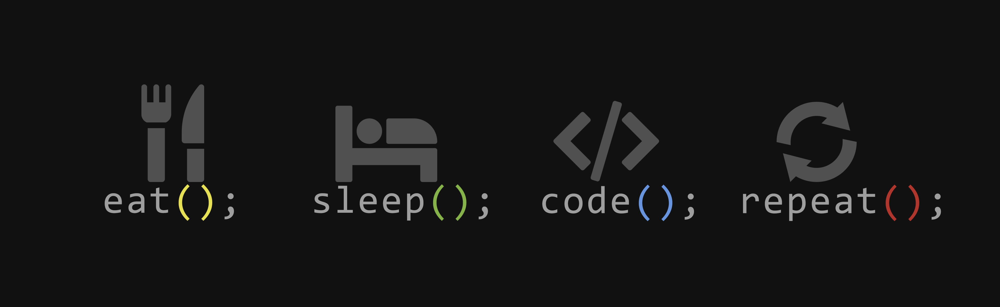

<h1 align="center">Hi 👋, I'm Kamal</h1>
<h3 align="center">A passionate Full Stack developer from India</h3>

  

- 🌱 I’m currently learning **Backend Development**
- 💬 Ask me about **Tailwind CSS, JavaScript, React.js, Next.js, Node.js, Express.js, MongoDB, PostgreSQL**
- 📫 How to reach me **kamal0000027@gmail.com**

---

<h3 align="left">Connect with me:</h3>

  
  

---

<h3 align="left">Languages and Tools:</h3>

---

  

